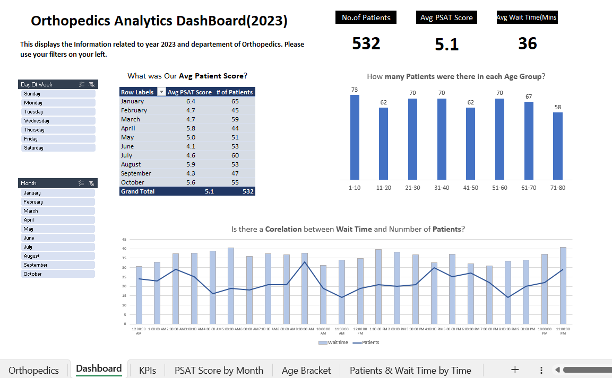

# Healthcare Data Analytics using Excel

This project, "Healthcare Data Analytics using Excel," provides a comprehensive overview of healthcare data analytics with a focus on Orthopedics in 2023. Using Excel, various key performance indicators (KPIs) and data visualizations were created to help analyze patient data, including average patient scores, wait times, and age demographics.

## Table of Contents
- [Project Overview](#project-overview)
- [Data and KPIs](#data-and-kpis)
- [Visualizations](#visualizations)
- [Insights](#insights)
- [Conclusion](#conclusion)

## Project Overview
This Excel-based analytics project is designed to provide insights into patient visits and service quality in the Orthopedics department for the year 2023. The dashboard leverages data visualizations and analytical tools within Excel to give a clear understanding of patient satisfaction and operational efficiency.

## Data and KPIs
The dataset includes patient scores, wait times, and demographics across various timeframes and age brackets. The following key performance indicators (KPIs) were calculated:
- **Total Number of Patients:** 532
- **Average Patient Satisfaction (PSAT) Score:** 5.1
- **Average Wait Time:** 36 minutes

The data is segmented by months, days of the week, and age groups to help identify trends and patterns.

## Visualizations
The dashboard includes the following visualizations:
1. **Average Patient Score by Month:** Displays monthly PSAT scores and patient counts to track changes in satisfaction over time.
2. **Patients by Age Group:** Bar chart showcasing the distribution of patients across different age brackets.
3. **Correlation Between Wait Time and Patient Volume:** A time-series chart illustrating the relationship between wait times and patient volumes throughout the day.

## Insights
From the analysis, several insights were drawn:
- **Monthly Satisfaction Scores:** Patient satisfaction tends to fluctuate month-to-month, with the highest average scores in January (6.4) and lowest in September (4.3).
- **Wait Time and Patient Volume Correlation:** Wait times and patient volume show some correlation, especially during peak hours. This information can be used to optimize staffing and reduce wait times.
- **Age Distribution:** The age groups 21-30 and 51-60 had the highest number of patients, indicating that these age brackets may require more resources.

## Conclusion
This project highlights the potential of Excel in data analytics, especially for healthcare data. Through data visualizations and KPIs, actionable insights can be derived to improve patient experience and optimize operations in healthcare settings.
